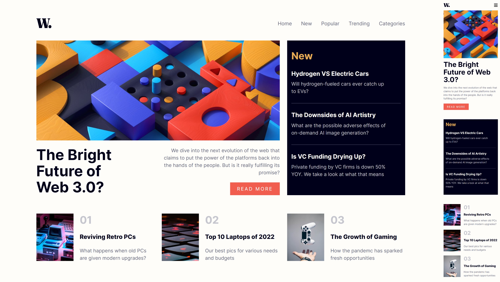

# Frontend Mentor - News homepage solution

This is my solution to the [News homepage challenge on Frontend Mentor](https://www.frontendmentor.io/challenges/news-homepage-H6SWTa1MFl)

## The challenge

Users should be able to:

- View the optimal layout for the interface depending on their device's screen size
- See hover and focus states for all interactive elements on the page
- **Bonus**: Toggle the mobile menu (requires some JavaScript)

### Links

- Solution URL: [Add solution URL here](https://www.frontendmentor.io/challenges/news-homepage-H6SWTa1MFl)
- Live Site URL: [Add live site URL here](https://jhon-okayda-news-homepage.netlify.app/)

### Built with

- Semantic HTML5 markup
- CSS custom properties
- Flexbox
- CSS Grid
- Mobile-first (Layout)

## Author

- Created by - okayda-jhon
